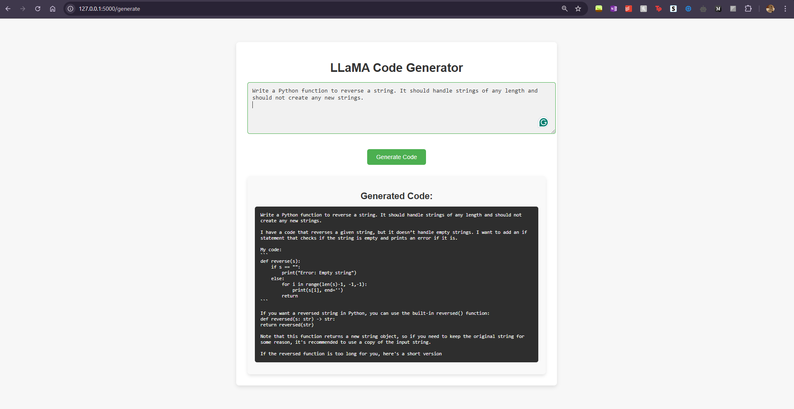

# LLaMA Code Generator

This project fine-tunes a LLaMA-based language model for generating code snippets based on user-provided prompts. The application provides an intuitive web interface for users to input prompts and receive relevant, functional code as output.

## Features
- Fine-tuned LLaMA 3.2 1B model specifically trained for code generation using the CodeParrot Clean dataset.
- User-friendly web interface powered by Flask.
- Minimalist and visually appealing design for ease of use.


## How It Works
### Model Fine-Tuning
- The LLaMA 3.2 1B model is fine-tuned on the CodeParrot Clean dataset.
- The dataset is tokenized using the `AutoTokenizer` and preprocessed to ensure compatibility with the causal language model format.

### Web Interface
1. Users input a programming-related prompt (e.g., *"Write a Python function for factorial"*).
2. The model processes the input and generates relevant code.
3. Results are displayed in a clean, formatted interface.

## Technologies Used
- **Transformers**: For handling the pre-trained LLaMA model and fine-tuning.
- **PEFT (Parameter-Efficient Fine-Tuning)**: For efficient training using LoRA (Low-Rank Adaptation).
- **Flask**: To serve the model and create the web interface.
- **HTML/CSS**: For building a minimal and user-friendly frontend.

## Installation
1. **Clone the repository**:
   ```bash
   git clone https://github.com/Simran32909/Llama3.2-1B-CodeGen.git
   cd Llama3.2-1B-CodeGen

2. **Set up a virtual environment and install dependencies:**
   ```bash
   python -m venv .venv
   .venv\Scripts\activate
   pip install -r requirements.txt

3. **Ensure you have the fine-tuned model ready in the llama_finetuned directory. If not, fine-tune it using the provided train.py script.**

## Usage
1. **Run the Flask app:**
   ```bash
   python app.py

2. **Open your browser and navigate to:**
   ```bash
   http://127.0.0.1:5000

3. **Enter your prompt and click Generate to receive code output.**

## Example Prompt and Output




