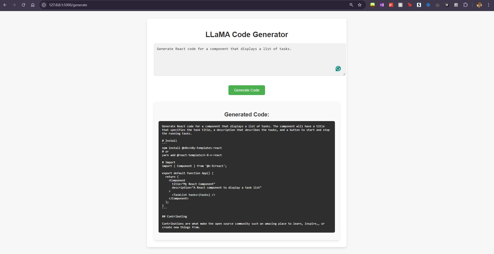

# CodeLLaMA

This project fine-tunes a LLaMA-based language model for generating code snippets based on user-provided prompts. The application provides an intuitive web interface for users to input prompts and receive relevant, functional code as output.

## Features
- Fine-tuned LLaMA 3.2 1B model specifically trained for code generation using the CodeParrot Clean dataset.
- User-friendly web interface powered by Flask.
- Minimalist and visually appealing design for ease of use.


## How It Works
### Model Fine-Tuning
- The LLaMA 3.2 1B model is fine-tuned on the CodeParrot Clean dataset.
- The dataset is tokenized using the `AutoTokenizer` and preprocessed to ensure compatibility with the causal language model format.

### Web Interface
1. Users input a programming-related prompt (e.g., *"Write a Python function for factorial"*).
2. The model processes the input and generates relevant code.
3. Results are displayed in a clean, formatted interface.

## Technologies Used
- **Transformers**: For handling the pre-trained LLaMA model and fine-tuning.
- **PEFT (Parameter-Efficient Fine-Tuning)**: For efficient training using LoRA (Low-Rank Adaptation).
- **Flask**: To serve the model and create the web interface.
- **HTML/CSS**: For building a minimal and user-friendly frontend.

## Installation
1. **Clone the repository**:
   ```bash
   git clone https://github.com/Simran32909/CodeLLaMA.git
   cd CodeLLaMA

2. **Set up a virtual environment and install dependencies:**
   ```bash
   python -m venv .venv
   .venv\Scripts\activate
   pip install -r requirements.txt

3. **Ensure you have the fine-tuned model ready in the llama_finetuned directory. If not, fine-tune it using the provided train.py script.**

## Usage
1. **Run the Flask app:**
   ```bash
   python app.py

2. **Open your browser and navigate to:**
   ```bash
   http://127.0.0.1:5000

3. **Enter your prompt and click Generate to receive code output.**

## Example Prompt and Output




## Mathematics Behind LoRA (Low-Rank Adaptation)

LoRA (Low-Rank Adaptation) is a parameter-efficient fine-tuning technique that reduces the computational and memory overhead of adapting large language models. It achieves this by leveraging low-rank approximation to represent weight updates in transformer layers. Here's a brief explanation of the mathematical foundation behind LoRA:

### Pretrained Model Weights

In transformer-based models like LLaMA, certain layers (e.g., attention layers) use weight matrices $W$ with large dimensions $d \times d$
  These matrices represent complex transformations, but not all degrees of freedom are necessary for adapting the model to a specific task.

### Low-Rank Approximation

LoRA assumes that updates to the weight matrix $W$   can be decomposed into the product of two smaller matrices $A$ and $B$:

$W_{\text{update}} = A \times B$, where:

- $A$ has dimensions $d \times r$
- $B$ has dimensions $r \times d$
- $r$ is the rank and is much smaller than $d$, making $A$ and $B$ significantly smaller than $W$.

This low-rank decomposition reduces the number of parameters to be learned during fine-tuning, making it highly efficient.

### Combined Output

The pretrained weights $W$ remain frozen, and the updated weights are computed as:

$W' = W + \alpha \times (A \times B)$

where $\alpha$ is a scaling factor to control the magnitude of the update.

### Efficiency

Compared to updating $W$ directly, learning $A$ and $B$ significantly reduces the number of trainable parameters:

- **Trainable parameters in LoRA**: $r \times (d + d) = 2rd$
- **Trainable parameters in full fine-tuning**: $d \times d$

This makes LoRA ideal for adapting large models like LLaMA on resource-constrained setups, such as CPUs.

### Application in This Project

In this project,I fine-tuned the LLaMA 3.2 1B model for code generation using LoRA. Here’s how LoRA was applied:

- **Target Modules**: Updates were restricted to specific layers in the transformer architecture, such as `q_proj` and `v_proj` (Query and Value projection layers in attention mechanisms).
- **Hyperparameters**:
  - Rank $r$: 8
  - Scaling factor $\alpha$: 32
  - Dropout: 0.1

### Result:

By freezing the pretrained weights and updating only the low-rank matrices, the model was efficiently adapted for code generation with reduced memory and computational requirements. This technique enabled fine-tuning on a CPU-only environment, demonstrating the power of LoRA in making state-of-the-art models more accessible.

### Intuition:
LoRA capitalizes on the observation that many weight updates during fine-tuning are redundant and can be expressed as linear combinations of a smaller set of parameters. This reduces redundancy while maintaining model expressivity.

## Known Issues
- **Slow Inference on CPU:** Since the model runs on CPU, response times may be longer. 
- **Irrelevant Output:** If the model outputs unrelated or incorrect code, consider improving the fine-tuning process or reformulating your prompt.

## Contributing
Contributions are welcome! Feel free to fork the repository and submit a pull request for any enhancements or bug fixes.

## License
This project is licensed under the MIT License.

## Acknowledgments
- [Meta AI](https://meta.ai) for the LLaMA model.
- [Hugging Face](https://huggingface.co) for providing excellent tools for model fine-tuning.
- [CodeParrot](https://github.com/CodeParrot) for the clean code dataset used in this project.
